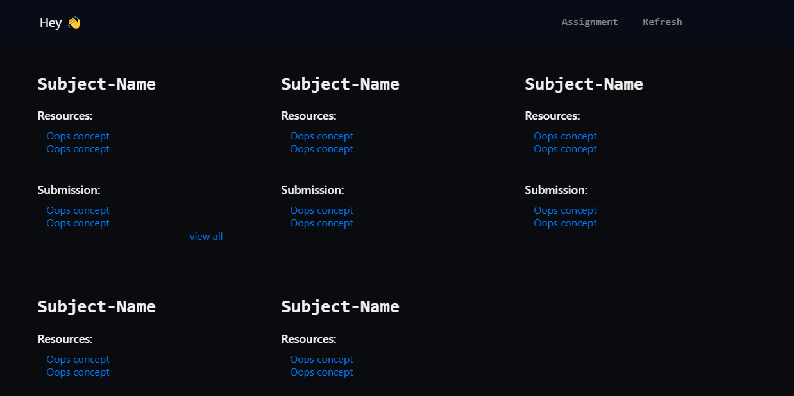
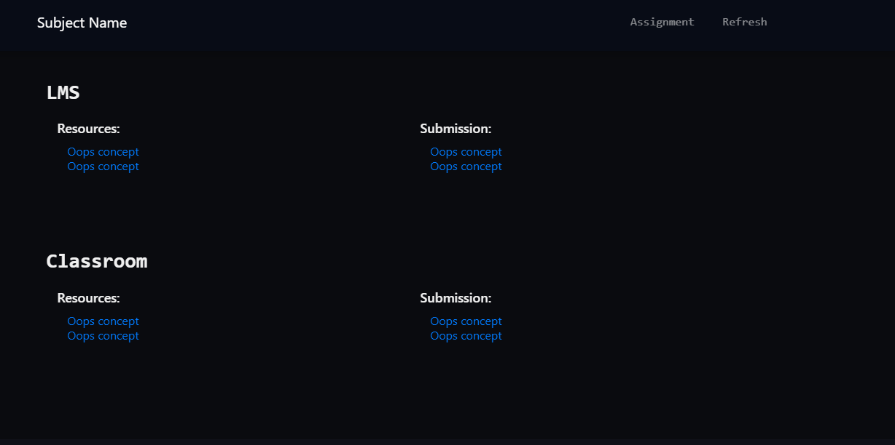
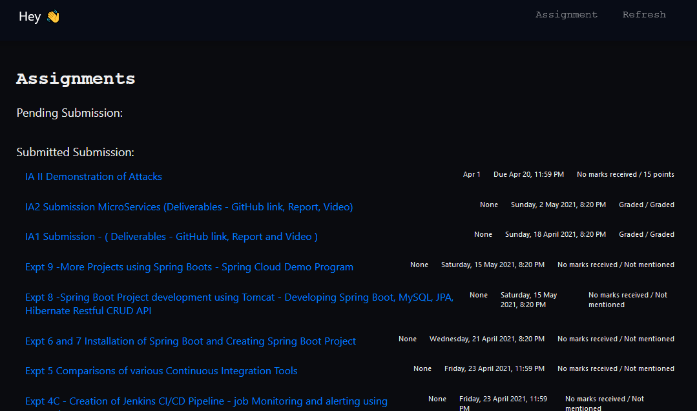

<h2 align="center">CourseTracker</h2>

<div align="center">


[](https://www.python.org/)
<br>


</div>

------------------------------------------

> Since mid-2020, owing to the pandemic, in-person classes have been done away with, and e-learning has been at the forefront. Hence, professors and educators now share study resources and assignments with their students using various e-learning platforms, the top 3 being Google classroom, LMS, and MS Teams. Since there isn't a single common platform for a particular college, students have to keep track of all three platforms to see their assignments, deadlines, and study resources. Naturally, they are bound to miss a thing or two. 
Hence, we have developed a centralized platform that will scrape and display all the resources and assignments posted on LMS and Google classroom. Therefore, students don't need to browse through various e-learning platforms to keep track of their courses.

------------------------------------------

<br>

<!-- <div align="center">
    <h3>Architecture/Event flow</h3>
</div>

<div align="center">
<a href="https://ibb.co/tsCYy81"></a>
</div>
<br> -->

The project uses Selenium and BeautifulSoup for web automation and scraping. The scraped data is served to the user over a webapage using Flask.  

### Tech stack
- Frontend - HTML, CSS, JavaScript, Bootstrap
- Backend - Flask, Selenium, Beautifulsoup  


<div align="center">
    <h3>Client</h3>
</div>

<div align="center"><h4> Home </h4>
The Home page displays all the subjects along with the 2 latest resources and assignments (if not submitted)
</div>

<div align="center">
<br>


</div>

<div align="center"><h4> Subject View </h4>
The Subject page displays resources and assignments of the selected subject
</div>
<div align="center">
<br>


</div>

<div align="center"><h4> Assignment View </h4>
The Assignment page displays all the assignments (pending + turned in) across all subjects  
</div>
<div align="center">
<br>


</div>


#### Endpoints

```
GET /home: Get details for all subjects 

GET /subject/<string:id>: Get info about the specific subject

GET /assignments: Get info about all submissions (pending + turned in)

POST /assignments/<assignment:id>: Submit a file for the specific assginment (works only for LMS for now)

```

<div align="center">
    <h3>Future work</h3>
</div>

- [ ] Integrating MS Teams
- [ ] Add pagination in frontend
- [ ] Allow users to submit assignments for google classroom
- [ ] Scrape tesxt based announcements on Google classroom
- [ ] Building a 3 layer architecture
- [ ] Notify users when assignment is submitted
- [ ] Add logging

<div align="center">
    <h3>Requirements</h3>
</div>
All the requirements of the project are available in requirements.txt file


<div align="center">
    <h3>Running the project locally</h3>
</div>

Install the required packages:

```
pip install -r requirements.txt
```

Running the flask server (debug mode disabled):
```
$ python3 app.py
```
To use debug mode we need to deactivate the reloader for the application to work smoothly  
Linux:
```
$ export FLASK_APP="app:app"
$ export FLASK_ENV="development"
```
On Windows:
```
$ set FLASK_APP="app:app"
$ set FLASK_ENV="development"
```

Running the flask server (in no reload mode - in normal mode the server is buggy):
```
$ flask run --no-reload
```

Subsequently, you will be asked to provide your login credentials (for LMS and Google classroom) and select the subjects you have enrolled in.

Then go check out [127.0.0.1:5000](http://localhost:5000)